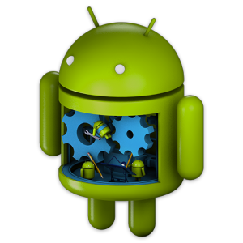
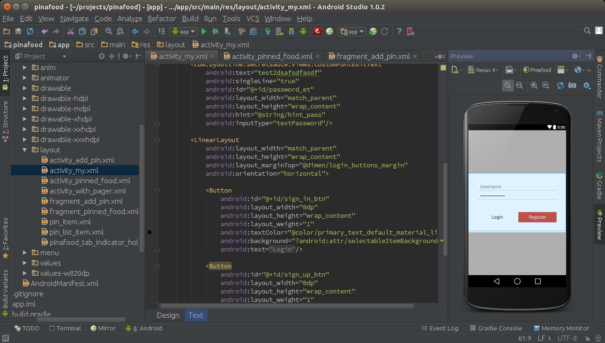
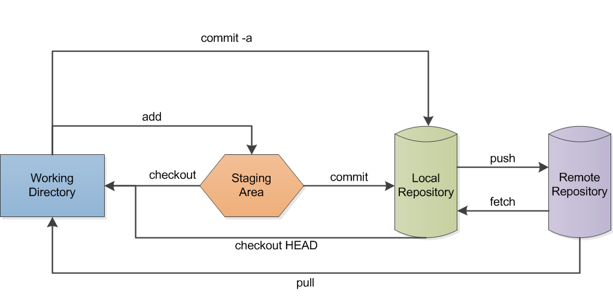
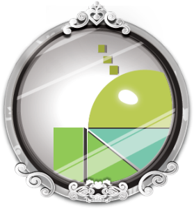
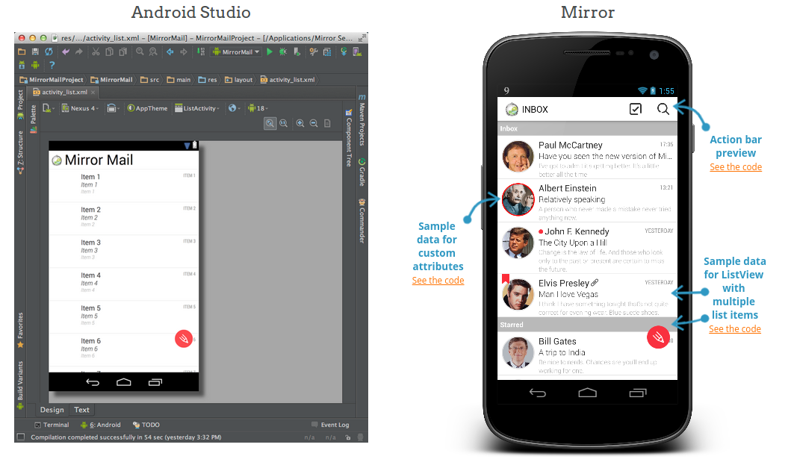
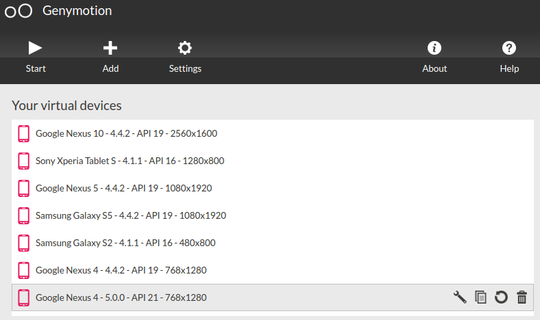
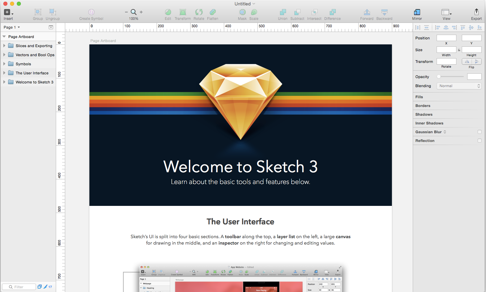
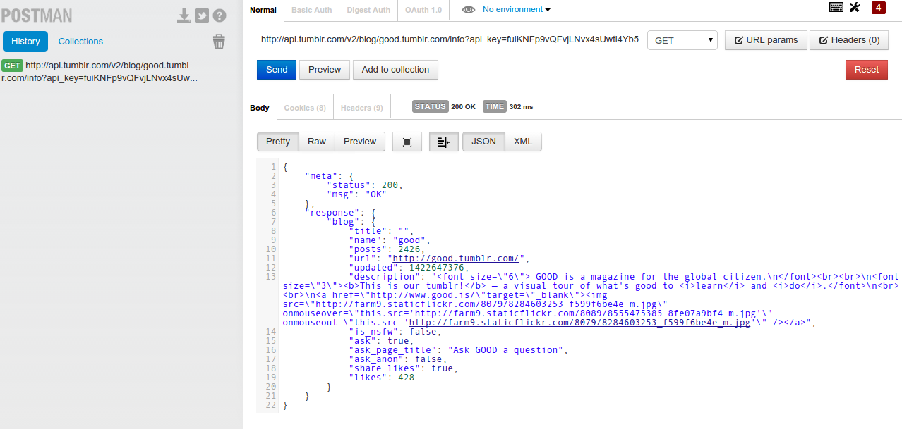
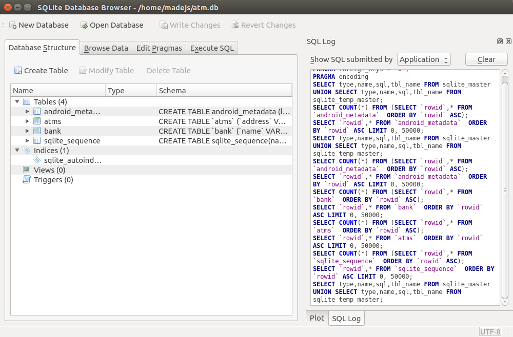
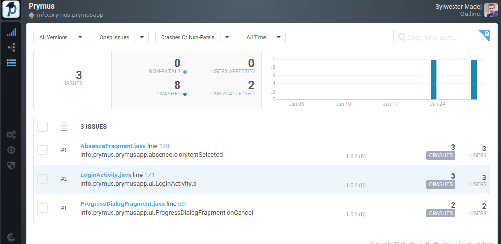

# Wstęp
Celem niniejszego Poradnika jest przedstawienie zestawu narzędzi i zasobów, których używanie wpływa na jakość i wydajność pracy programisty. Są to narzędzia, które sprawdziły się podczas tworzenia wielu aplikacji. Wybór ten potwierdziło wielu programistów, z którymi rozmawiałem na imprezach takich jak Mobile Warsaw, Droidcon czy Mobilization.

Postarałem się wybrać po jednym elemencie, z każdej kategorii. W przypadku gdy znam inne, podobne rozwiązania, podaje je jako alternatywy. Ułatwia to proces wyboru osobom początkującym, jednak sam wychodzę z założenia, że nie ma narzędzi idealnych do wszystkiego i sam co jakiś czas szukam nowych, lepszych rozwiązań.

Duża część narzędzi jest bezpłatnych. W przypadku rozwiązań płatnych podaję minimalną cenę jaką trzeba zapłacić jako niezależny programista za najprostszą, ale wystarczającą wersję produktu.

Mam nadzieję, że programiści zaczynający swoją przygodę z profesjonalnym tworzeniem aplikacji znajdą tu masę wskazówek, jak od samego początku pracować "zgodnie ze sztuką". Ponadto, w przypadku osób bardziej doświadczonych, chciałbym abyście znaleźli dla siebie przynajmniej 2-3 fajne narzędzia, które się wam przydadzą.

# Narzędzia
Zaczynamy od śmietanki, czyli produktów dostępnych jako aplikacje desktopowe lub wtyczki do takich aplikacji. Są to elementy, z którymi programista spędza najwięcej czasu i stanowią ekosystem, który łączy się ze sobą dosyć dobrze, jednocześnie uzupełniając swoje możliwości.

## Android Studio

| *Strona*      | http://developer.android.com/sdk/index.html |
| *Cena*        | FREE                                        |
| *Alternatywy* | ADT/Eclipse, InteliJ IDEA (€207)            |

{width=30%}

Android Studio powstało jako rozwinięcie wsparcia dla Androida, dostępnego w Intelij IDEA Community Edition. Zostało namaszczone przez Google jako nowe oficjalne środowisko do tworzenia aplikacji na platformę Android. Dzięki połączeniu doskonałego IDE dopracowywanemu przez lata przez firmę JetBrains oraz oficjalnemu wsparciu zespołu Google, jest ono zdecydowanie lepsze od ADT (IDE opartego o Eclipse).

W celu maksymalizacji wydajności korzystania z AS, warto poświęcić nieco czasu i nauczyć się skrótów klawiszowych oraz poznać np. mechanizm szablonów generujący kod, który często się powtarza. Każda minuta poświęcona w naukę sztuczek w AS, to inwestycja w przyszłość. Istnieje wiele czynności, które są często powtarzane, a które da się przyśpieszyć np.: generowanie par getter/setter, refaktoryzacja kodu, czy chociażby obsługa systemów kontroli wersji z poziomu kodu.

## Gradle (New Build System)

| *Strona*      | http://tools.android.com/tech-docs/new-build-system/ |
| *Cena*        | FREE                                                 |
| *Alternatywy* | Maven, ANT                                           |

{width=50%}

Gradle został wybrany przez Google jako podstawa New Build System, który używany jest m.in. w Android Studio. Dzięki mechanizmowi zarządzania zależnościami wykorzystującymi istniejące repozytoria wykorzystywane dotychczas przez Maven, możliwe jest korzystanie z setek bibliotek, po dodaniu jednej linii opisującej każdą z nich. Zastosowanie Gradle pozwoliło ujednolicić konfigurację projektu, dzięki czemu w chwili obecnej budowanie z linii poleceń i IDE wygląda tak samo i korzysta z tej samej konfiguracji.

Warto poświęcić kilka godzin, aby poznać bardziej zaawansowane możliwości systemu np. Flavors (smaki projektu), możliwość pisania fragmentów skryptu w języku Groovy czy choćby opcje dostępne w Android Plugin dla Gradle.

{title="Prosty plik build.gradle dla aplikacji Android"}
~~~~~~~~
apply plugin: 'com.android.application'

android {
    compileSdkVersion 21
    buildToolsVersion "21.1.2"
    defaultConfig {
        applicationId "com.soldiersofmobile.myapplication"
        minSdkVersion 15
        targetSdkVersion 21
        versionCode 1
        versionName "1.0"
    }
    buildTypes {
        release {
            minifyEnabled false
            proguardFiles getDefaultProguardFile('proguard-android.txt'), 'proguard-rules.pro'
        }
    }
}
dependencies {
    compile fileTree(dir: 'libs', include: ['*.jar'])
    compile 'com.android.support:appcompat-v7:21.0.3'
}
~~~~~~~~

## ProGuard

| *Strona*      | http://proguard.sourceforge.net/                                                                   |
| *Cena*        | FREE                                                                                               |
| *Alternatywy* | DexGuard (€480) - rozszerzenie ProGuard o m.in. szyfrowanie napisów, dużo lepsze zaciemnianie kodu |

*ProGuard* powstał jako darmowe narzędzie do optymalizacji, zmniejszania i zaciemniania plików klas, powstałych w wyniku kompilacji kodu źródłowego w języku *Java*.

Został przystosowany przez zespół z *Google*, do współpracy z Androidem i od samego początku stanowi podstawowe narzędzie do zmniejszania objętości klas w pliku APK.

Warto nauczyć się korzystać z niego, przede wszystkim dla jego trzech unikalnych funkcji:

* usuwania niepotrzebnych klas, które zapomnieliśmy usunąć z projektu lub zostały dodane w pliku JAR jakiejś biblioteki,

* zaciemniania kodu (zmiana nazw metod i klas oraz pakietów), które utrudnia ciekawskim poznanie, jak nasza aplikacja działa,

* usuwania niepotrzebnych fragmentów kodu z klas (np. nieużywanych metod, albo miejsc w których logowaliśmy coś do Logcat), co okazuje się niezwykle przydatne ze względu na limit 64 tysięcy metod w aplikacji.

Najczęściej *ProGuard* uruchamiany jest podczas budowania APK w wersji Release, czyli takiego jakie potrzebne jest do umieszczenia w *Google Play*. W przypadku budowania w *Android Studio*/*Gradle*, konieczne jest ustawienie flagi __minifyEnabled=true__, aby aktywować *ProGuard* jako jeden z kroków tworzenia pliku APK.

Proces działania *ProGuard* jest sterowany przez plik konfiguracyjny __proguard-rules.pro__ lub podobny. Ważne, aby pamiętać, że ProGuard potencjalnie może usunąć zbyt dużo, co może powodować, że aplikacja przestanie działać poprawnie. Zwykle wynika to z faktu, że aplikacja (lub jedna z użytych bibliotek) korzysta z mechanizmu Refleksji czyli opiera swoje działanie o nazwy metod, które ulegają zmianie podczas zaciemniania. W takim wypadku trzeba do pliku konfiguracyjnego dodać zestaw wyjątków, które informują, że danych metod lub klas nie należy zmieniać. Często biblioteki posiadają w swojej dokumentacji gotowe fragmenty konfiguracji, które trzeba wkleić, aby poprawnie działały po użyciu ProGuarda.

{title="Fragment pliku proguard-rules.pro"}
~~~~~~~~
-keep class com.soldiersofmobile.app.events.** {*;}

# REMOVE LOGS IN RELEASE BUILDS
-assumenosideeffects class android.util.Log {
    public static *** d(...);
}

# GENERAL
-keepnames class * implements android.os.Parcelable {
    public static final ** CREATOR;
}
-keepattributes Signature,*Annotation*,EnclosingMethod,SourceFile,LineNumberTable

# KEEP FACEBOOK SDK CLASSES
-keep class com.facebook.** { *; }
~~~~~~~~

## Git

| *Strona*      | http://git-scm.com/    |
| *Cena*        | FREE                   |
| *Alternatywy* | Mercurial, SVN, Baazar |

{width=50%}

Rozproszony system kontroli wersji, który powstał aby zarządzać kodem jądra systemu Linux. Jest to podstawowe narzędzie, które każdy programista powinien sobie przyswoić, ponieważ pozwala współdzielić kod w zespole, podmieniać wersje, zapisuje każda wersję pliku.

Git w chwili obecnej jest de facto standardem w projektach informatycznych i każdego dnia rośnie ilość narzędzi i usług, które powstały z myślą o nim. W przypadku starszych projektów, nadal można spotkać się jeszcze z narzędziem SVN, które jest rozwiązaniem słabszym, ze względu na konieczność korzystania z centralnego serwera.

Idea pracy z Git opiera się o zapisywanie kolejnych wersji interesujących nas plików, w lokalnym repozytorium, które znajduje się w katalogu projektu. Dzięki temu możemy śledzić zmiany bez połączenia z siecią i synchronizować się z innymi członkami zespołu, tylko kiedy tego potrzebujemy.

Dużą wartością Git jest bardzo łatwy i lekki sposób pracy z gałęziami (branches), które pozwalają np. pisać nowe elementy aplikacji, jednocześnie mając dostęp do wersji stabilnej.

## Mirror

| *Strona*      | http://jimulabs.com/ |
| *Cena*        | $79                  |
| *Alternatywy* | -                    |

{width=30%}

Mirror jest nowością, która szybko się rozwija i z mojego doświadczenia wprowadza zupełnie nowy sposób pracy nad interfejsem użytkownika aplikacji Android.

W dużym skrócie, zadaniem Mirror-a jest usunięcie konieczności przebudowywania i wgrywania aplikacji po wykonaniu zmiany w plikach z zasobami.

Mirror opiera się na własnych plikach XML, w których opisuje się, jakie layouty mają być wyświetlone na ekranie oraz jakimi danymi mają zostać wypełnione. Daje to szansę podejrzenia bardzo przybliżonego podglądu aplikacji, bez konieczności pisania kodu Java i przetestowania tego, na wielu urządzeniach jednocześnie.

Więcej informacji na mojej prezentacji z [Mobilization](http://soldiersofmobile.com/mobilization-2014-wideo-z-mojej-prezentacji/).

## Genymotion

| *Strona*      | https://www.genymotion.com                    |
| *Cena*        | FREE - dla zastosowań osobistych              |
| *Alternatywy* | Emulator x86 z włączoną obsługą wirtualizacji |

Genymotion to fenomen. Projekt zaczął jako próba uruchomienia emulacji Androida w wersji na procesory x86, z wykorzystaniem VirtualBox. Obecnie rozrósł się do pełnoprawnego produktu, z którego korzysta ponad 2.5M programistów. Duża część z nich płaci, co gwarantuje ciągły rozwój projektu oraz coraz nowsze opcje.

Narzędzie to ma dwie podstawowe zalety nad emulatorami dostarczanymi przez Google.

- Jest dużo szybsze (znane są przypadki uruchamiania topowych gier 3D z Androida).

- Ma możliwość korzystania z Google Apps (Google Play, Gmail, Mapy i wszystko co wymaga Google Play Services), tak jakby to był telefon. Obsługa ta jest co prawda nieoficjalna (ze względów licencyjnych obrazy emulatorów nie mogą zawierać tych aplikacji), ale działa bardzo dobrze.

W przypadku, gdy z jakiś powodów zdecydujesz, że Genymotion nie jest dla Ciebie, to warto skorzystać z emulatorów x86, które są dużo szybsze od ARM, zwłaszcza jeśli mamy w systemie obsługę wirtualizacji (HAXM w Windows i MacOS X, KVM w Linux). Ta kombinacja powoduje, że wszystkie operacje z emulatora uruchamiane są bezpośrednio na procesorze naszego komputera i nie wymagają tłumaczenia, jak w przypadku ARM.

## Calabash

| *Strona*      | http://calaba.sh/          |
| *Cena*        | FREE                       |
| *Alternatywy* | Robotium, Espresso, Appium |

{width=50%}

Calabash jest narzędziem służącym do testów funkcjonalnych (klikanie po UI) aplikacji stworzonych na platformy Android i iOS.

Główna idea wywodzi się z narzędzia Cucumber, które jest popularne wśród programistów Ruby. Chodzi o to, aby scenariusze testów były pisane w pseudojęzyku, który z założenia ma przypominać mocno sformalizowany język angielski.Zadaniem Calabasha jest przetłumaczenie tych sformułowań na zdarzenia wykonywane na aplikacji.

Dużą zaletą jest brak konieczności dotykania kodu aplikacji, więc pozwala też na testowanie aplikacji, do których nie ma się dostępu (BlackBox testing).

Przykładowy scenariusz:

    Scenario: As a invalid user I cannot log into my app
      Given I am on "LoginActivity"
      When I press view with id "login_button"
      Then I take a screenshot
      Then I see the text "Pole wymagane"

## Jenkins CI

| *Strona*      | http://jenkins-ci.org/      |
| *Cena*        | FREE                        |
| *Alternatywy* | Travis CI, Bamboo, TeamCity |

{width=50%}

Continous Integration, to technika, w której serwer co pewien czas pobiera kod źródłowy i sprawdza czy uda się go skompilować, uruchomić i przetestować. Dzięki temu już w kilka minut po umieszczeniu zmian w systemie kontroli wersji, możemy się dowiedzieć czy coś zepsuliśmy np. poprzez mail rozsyłany do osób zainteresowanych.

Jenkins, to jedna z lepszych implementacji CI, a do tego darmowa. Dużą dodatkową zaletą jest możliwość skorzystania z dziesiątek pluginów, które potrafią obsługiwać różne narzędzia, systemy kontroli wersji lub po prostu wyświetlać ładniejsze raporty. Pluginem, który na pewno warto używać dla testowania aplikacji jest Android Emulator Plugin, który odpowiada za tworzenie emulatorów, uruchamianie ich i zarządzanie aktualnie uruchomionymi.

Przykładowy cykl, który może realizować Jenkins CI:

1. Pobranie kodu z Git, SVN, Mercurial.

2. Zbudowanie paczki z użyciem Gradle.

3. Instalacja paczki na odpalonym na początku emulatorze, który działa na serwerze) lub urządzeniu.

4. Uruchomienie testów z wykorzystaniem np. Calabash lub Espresso.

5. Po udanym zbudowaniu i przetestowaniu, wysłanie do kanału Alpha w Google Play lub na jakąś usługę do dystrybucji paczek np. Crashlytics.

## Sketch

| *Strona*      | http://bohemiancoding.com/sketch/        |
| *Cena*        | $99                                      |
| *Alternatywy* | Photoshop CC (E12.29/mc w CreativeCloud) |

{width=30%}

Sketch staje się w środowisku designerów następcą Photoshopa. Jego główne zalety to: dostosowanie do pracy z koncepcją ekranów, niska cena, prostota obsługi. Podstawowa wada, to konieczność korzystania z MacOS X.

Warto posiadać Sketch jeśli często otrzymujemy grafiki w tym formacie i nie chcemy polegać na kimś, kto może akurat nie mieć czasu. Korzysanie z aplikacji jest proste i można nawet wykorzystać go jako narzędzie do tworzenia Mockup'ów aplikacji.

Jest to produkt otwarty na rozwój, z dobrym community, co przekłada się na dużą ilość wtyczek, które pozwalają np. na szybki eksport grafik do różnych rozdzielczości. Widziałem nawet wersje, które pozwalają generować kod layoutów prosto z projektu w Sketch.

## Postman – Rest client

| *Strona*      | http://www.getpostman.com/ |
| *Cena*        | FREE                       |
| *Alternatywy* | RESTClient dla Firefox     |

Bardzo przydatny plugin do przeglądarki Chrome, pozwalający na testowanie API REST, bez konieczności pisania kodu. Przyjemy interfejs użytkownika pozwala na zarządzanie wieloma zapytaniami jednocześnie i testowanie API, z którym będzie się komunikowała nasza aplikacja.

Do głównych zalet Postman'a należy zaliczyć:

* łatwość tworzenia wszelkiego rodzaju zapytań HTTP,

* obsługa autentykacji używanych w HTTP, w tym OAuth,

* formatowanie wyniku zapytania jako JSON albo XML,

* historia zapytań.

Narzędzie to warto wykorzystać, aby sprawdzić API zanim zaczniemy implementować dane zapytanie po stronie aplikacji. Ponadto jest to idealne rozwiązanie dla programistów tworzących API, którzy chcą przetestować jak będzie się zachowywało dla prawdziwych danych.

## DB Browser for SQLite (dawniej SQLite Browser)

| *Strona*      | http://sqlitebrowser.org/           |
| *Cena*        | FREE                                |
| *Alternatywy* | SQLite Manager - plugin dla Firefox |

Kolejne proste narzędzie, które może oszczędzić godziny. DB Browser, jak sama nazwa wskazuje, służy do przeglądania zawartości bazy SQLite. Poza przeglądaniem daje także możliwości edycji oraz wykonywania zapytań SQL i podglądu wyników. Jest to doskonała alternatywa dla konsolowego klienta *sqlite3*, który jest dostarczany z SDK Androida. Jedyną wadą jest konieczność pobrania pliku z urządzenia do lokalnego systemu plików np. poleceniem `adb pull`. Od tej chwili mamy plik, na którym możemy wykonywać dowolne operacje. Jeśli dokonamy zmian, to zmieniony pliku musimy umieścić znów na urządzeniu poleceniem `adb push`.

# Usługi

## Gradle, Please

| *Strona*      | http://gradleplease.appspot.com/ |
| *Cena*        | FREE                             |
| *Alternatywy* | -                                |

### Opis

## Bitbucket

| *Strona*      | https://bitbucket.org/ |
| *Cena*        | FREE                   |
| *Alternatywy* | Github, Gitlab         |

Bitbucket to product firmy Atlasian, znanego twórcy narzędzi dla zespołów programistycznych (m.in. Jira, Confulence, Bamboo). Usługa ta pozwala na darmowe przechowywanie nieograniczonej ilości prywatnych repozytoriów, z ograniczeniem do 5 użytkowników. Sprawdza się to bardzo dobrze nawet dla niewielkich zespołów/projektów i pozwala zacząć pracę z Gitem, bez konieczności konfigurowania własnego serwera.

Dodatkowo, Bitbucket posiada dobrze rozwiniętą opcje korzystania z mechanizmu Pull Request, który pozwala innym członkom naszego zespołu na sprawdzenie naszego kodu (Code Review).

## Parse

| *Strona*      | https://parse.com                                 |
| *Cena*        | FREE do 30 req/s                                  |
| *Alternatywy* | Firebase, Google AppEngine, Azure Mobile Services |

Parse to rozwiązanie typu Mobile Backend as a Service, czyli część serwerowa dla naszej aplikacji, bez konieczności pisania kodu. Twórcy tej usługi postawili sobie za zadanie uproszczenie do maksimum czynności, które do tej pory trzeba było implementować w API. Mamy więc mechanizm operowania na danych w tabelach, wysyłanie wiadomości PUSH, analitykę, logowanie FB i Twitter, a nawet pisanie logiki po stronie serwera w JS.

Przykładowo: utworzenie backendu dla aplikacji typu Tinder nie wymaga od nas pisania kodu, ponieważ możemy skorzystać z:

* logowania FB i automatycznego tworzenia kont w Parse,

* zapisywania profilów, wiadomości, położenia użytkownika w odpowiednich tabelach,

* wyszukiwania użytkowników w określonej odległości dzięki geoquery,

* powiadamiać użytkownika o nowych aktywnościach na profilu, poprzez wiadomości PUSH.

Do momentu gdy nasza aplikacja nie zacznie uzyskiwać znaczącego ruchu, wszystko to mamy za darmo.

## Crashlitycs

| *Strona*      | https://crashlytics.com            |
| *Cena*        | FREE                               |
| *Alternatywy* | Applause, Splunk MINT, Google Play |

{width=50%}

Każda aplikacja umieszczona na sklepie wcześniej lub później będzie miała crashe. Nie da się tego uniknąć, bo nie da się też przetestować aplikacji na każdym z dziesiątek tysięcy urządzeń. Dlatego warto wyposażyć naszą aplikację w mechanizm automatycznego zgłaszania błędów, który w przypadku wystąpienia błędu wyśle krótką wiadomość na nasz serwer. Crashlytics sprawdza się w tej roli świetnie, a dodatkowo posiada piękny interfejs web, na którym można przeglądać informację o zaistniałych błędach łącznie z informacjami, na jakim modelu, wersji systemu i sprzęcie wystąpiły.

W przypadku, gdy korzystaliśmy z mechanizmu obfuskacji w ProGuard, będziemy potrzebowali pliku z mapowaniem, ponieważ nazwy metod w których wystąpił błąd będą już zmienione.

## StackOverflow

| *Strona*      | https://crashlytics.com |
| *Cena*        | FREE                    |
| *Alternatywy* | -                       |

## Github

| *Strona*      | https://crashlytics.com |
| *Cena*        | FREE                    |
| *Alternatywy* | -                       |

## TestDroid

| *Strona*      | http://testdroid.com/ |
| *Cena*        | FREE                  |
| *Alternatywy* | Appthwack, Saucelabs  |

## FluidUI

| *Strona*      | https://www.fluidui.com/   |
| *Cena*        | FREE                       |
| *Alternatywy* | Proto.io, Balsamiq Mockups |

Klikalne prototypy stanowią jedną z najlepszych form dokumentacji w komunikacji programista<->klient. Pozwalają przedstawić potrzebne ekrany, sposoby nawigacji pomiędzy nimi oraz przetestować aplikację na żywym organizmie, bez konieczności uruchamiania IDE. Bardzo często zmniejszają ryzyko niedomówień lub ujawniają braki w projekcie.

Warto zacząć tworzenie prototypu już na etapie tworzenia lub czytania specyfikacji. Najlepiej jeśli jest to mockup typu Lo-Fi (niskiej szczegółowości, bez graficznych ozdób), tak aby klient nie przywiązywał się do jego wyglądu, tylko skupiał na nawigacji i kompletności danych.

Fluid UI jest przykładem rozwiązania, które pozwala zaprojektować ekrany, dodać proste akcje (np. przejścia pomiędzy ekranami po naciśnięciu przycisku) i zaprezentować wynik w przeglądarce na telefonie klienta. Wystarczy przesłać link do wygenerowanego prototypu, który potencjalny użytkownik, może sobie przetestować na urządzeniu.

# Biblioteki
Każdy programista dochodzi do takiego momentu, że stwierdza, że coraz więcej kodu, który pisze się powtarza. Dlatego własnie tak ważne jest korzystanie z bibliotek w projektach, zwłaszcza z tych, które są sprawdzone i uznawane za standard. Dzięki temu, ktoś kto będzie przeglądał nasz projekt od razu będzie czuł się jak w domu.

W chwili obecnej duża popularnością cieszą się biblioteki stworzone przez firmę Square. Więcej informacji możesz znaleźć w mojej prezentacji z Warsjawa, wraz z przykładami zastosowania opisanych bibliotek.

## ButterKnife

| *Strona*      | http://jakewharton.github.io/butterknife/ |
| *Cena*        | FREE                                      |
| *Alternatywy* | RoboGuice, AndroidAnnotations             |

Bardzo prosta bibliteka, która generuje kod związany z dostępem do UI na podstawie anotacji. Pozwala:

* zamienić findViewById + rzutowanie na @InjectView

* listenery na @OnClick, @OnItemClick

* operować na wielu widokach jednocześnie z użyciem tablic widoków.

Bardzo dobrze sprawdza się w połączeniu z pluginem do Android Studio o nazwie android-butterknife-zelezny. Dzięki tej parze generowanie kodu wyciągającego widoki z layoutu sprowadza się do wywołania jednej opcji z menu.

## Otto

| *Strona*      | http://square.github.io/otto/ |
| *Cena*        | FREE                          |
| *Alternatywy* | EventBus                      |

Otto to szyna danych, która działa podobnie do LocalBroadcast. W pewnym miejscu aplikacji wysyłamy zdarzenie, które odbierane jest w innych miejscach, które zapisały się na informacje o tym zdarzeniu (mechanizm Post/Subscribe). Główną przewagą nad androidowymi broadcastami jest fakt, że przesyłamy obiekty POJO, a nie instancje klasy Bundle, co zmniejsza szanse na pomyłkę i jest dużo szybsze w implementacji.

Wykorzystanie szyny do komunikacji pomiędzy komponentami zmniejsza ilość zależności pomiędzy nimi, a zwłaszcza konieczność implementowania dużej ilości interfejsów. Niestety, w przypadku dużych projektów wymaga dużej dyscypliny, aby zapanować nad ilością zdarzeń które są przesyłane. W takim przypadku niezwykle przydatny okazuje się plugin otto-intellij-plugin, który pozwala w łatwy sposób nawigować pomiędzy miejscami, w których zarzenie jest emitowane i odbierane.

## Retrofit

| *Strona*      | https://github.com/square/retrofit   |
| *Cena*        | FREE                                 |
| *Alternatywy* | Spring Rest Template, AQuery, Volley |

Retrofit to najprzyjemniejszy sposób korzystania z API REST z poziomu Androida. Naszym zadaniem jest napisanie interfejsu zawierającego wszystkie metody, które będziemy chcieli wywołać na API, oraz dorzucenie anotacji, które opisują pod jakie URL-e mają te zapytania uderzać, jakie parametry wysyłać i co odbierać.

Resztę generuje za nas Retrofit. Otrzymujemy konkretną klasę, na której możemy wywoływać te metody. Wbudowana obsługa GSON, zapewnia nam automatyczne mapowanie obiektów POJO na JSON i odwrotnie. Łatwiej się nie da.

## Dagger

| Strona      | http://square.github.io/dagger/ |
| Cena        | FREE                            |
| Alternatywy | RoboGuice, Dagger2              |

Dagger to implementacja wzorca Dependency Injection, czyli wstrzykiwania zależności. Celem tego podejścia jest minimalizacja ilości miejsc, w których tworzymy obiekty poprzez `new NazwaKlasy()` i stworzenie centralnego repozytorium obiektów, którze możemy sobie wstrzyknąc w dowolnym miejscu aplikacji. W przypadku Androida jest to szczególnie przydatne, ponieważ często potrzebujemy w różnych Activity albo Fragmentach dostępu do np. SharedPreferences. Polecam przeczytanie dokumentacji i zaczęcie od wstrzykiwania prostych obiektów np. swoich Managerów.

## Picasso

| Strona      | http://square.github.io/picasso/       |
| Cena        | FREE                                   |
| Alternatywy | AQuery, Volley, Universal Image Loader |

Picasso to biblioteka do wyświetlania obrazków z internetu. Kropka. Posiada proste API i automatyzuje pobieranie plików graficznych, zmianę ich rozmiaru, wyświetlanie w ImageView, cache w pamięci ram i flash. Dzięki temu możemy skupić się na tym, co ma być wyświetlone, a nie jak.

# Kody źródłowe

## Google IO App
https://github.com/google/iosched

Każdego roku Google IO jest najważniejszą konferencją, na której ekipa z Mountain View prezentuje nowości w SDK Androida. Niedługo po tym wydażeniu udostępniany jest kod źródłowy oficjalnej aplikacji, powstałej na to wydażenie, która jednocześnie prezentuje jak najwięcej z nowości w SDK.

Warto przejrzeć, choć z doświadczenia wiem, że kod nie jest idealny i trudny w czytaniu, ale zdecydowanie prezentuje dużo nowości.

## Android Bootstrap
http://www.androidbootstrap.com/

Android Bootstrap pełni dwie role. Z jednej strony, jest to generator szkieletu projektu, a z drugiej sam szkielet jest dobrym przykładem przemyslanego projektu ze sporą ilością współpracująch biblotek.

## u2020
https://github.com/JakeWharton/u2020

Mały projekt prezentujący, jak połączyć ze sobą wiele z opisanych wcześniej biblitek Square.

# Źródła wiedzy

## Strony

### Soldiers of Mobile - Blog
http://soldiersofmobile.com

Blog, który tworzę w wolnym czasie pomiędzy projektami i szkoleniami. Staram się przekazywać spostrzeżenia dotyczące tworzenia aplikacji, zwłaszcza od strony warsztatu programisty.

### Android Weekly
http://androidweekly.net/

Cotygodniowa porcja przydatnych zasobów dotyczących programowania na Androida, przebranych i zebranych w jednym miejscu. Nowe biblioteki, posty na blogach i filmy wideo. Istnieje możliwość przeglądania na stronie internetowej, lub zamówienie subskrybcji wprost do skrzynki email.

### MaterialUp
http://www.materialup.com/

Ładny katalog ładnych aplikacji. Celem MaterialUp jest prezentowanie dobrych przykładów impementacji stylu Material Design w aplikacjach. Są tu nie tylko aplikacje Android, ale także iOS, a nawet aplikacje Web. Dobre źródło inspiracji i benchmarków. Zawsze polecam swoim klientom, aby zobaczyli co mogą zyskać idąc w kierunku Material Design.

### Android Arsenal
https://android-arsenal.com/

Największy katalog bibliotek, narzędzi i przykładów na Androida. Z możliwością przeszukiwania wg. różnych kryteriów m.in. cena, rodzaj, zastosowanie. Można potraktować jako rozbudowaną wersję tego ebooka. Niestety liczba dostępnych elementów powoduje, że pomiędzy perełkami jest dużo słabych bibliotek.

## Kanały YouTube
Dla tych, którzy wolą oglądać wideo, zamiast czytać istnieje kilka kanałów, które warto dodać do swoich subskrybcji na YouTube, aby na bieżąco dostawać powiadomienia.

### Soldiers of Mobile - YouTube
https://www.youtube.com/channel/UCQUuM6One5W6odx8dDJ8Vsw

I znów kryptoreklama. Początkowo umieszczałem kursy, chwilowo lądują tam głównie zapisy z moich prezentacji na różnych wydarzeniach. Szczerze zachęcam do subskrybcji.

### Android Developers
https://www.youtube.com/channel/UCVHFbqXqoYvEWM1Ddxl0QDg

Ważny kanał dla tych, którzy chcą wiedzieć co nowego Google tym razem dodał do Androida. Oficjalny kanał, na którym zespół programistów z Google informuje o zmianach, a także pokazuje najlepsze praktyki. Aktywny najbardziej po Google IO, gdy następują ogłoszenia nowych API i narzędzi.

### Google Developers
https://www.youtube.com/channel/UC_x5XG1OV2P6uZZ5FSM9Ttw

Drugi oficjalny kanał. Związany nie tylko z samym Androidem, ale także otaczającym go ekosystemem usług Google.

### NewCircle Training
https://www.youtube.com/channel/UCkQX1tChV7Z7l1LFF4L9j_g

Świetne źródło doskonałych prezentacji z zakresu różnych prezentacji. Warto obejrzeć zwłaszcza serię Android Bootcamp. Jest już nieco czasowa, ale większość poruszonych tam tematów nadal jest aktualna i bardzo dobrze wytłumaczona.

## Książki

### The Busy Coder's Guide to Android Development
http://commonsware.com/Android/

Nietypowa książka autorstwa Mark'a Murphy'ego. Dostępna jedynie w postaci rocznej subskrybcji, w trakcie której otrzymujemy dostęp do aktualizacji ksiązki, których zwykle jest kilka rocznie. Jedyny tytuł, który mogę polecić z czystym sumieniem, ponieważ w każdym momencie jest aktualna. No i ta objętość: prawie 3000 stron (tak, trzy tysiące)!

# Warto śledzić

## Jake Wharton

| *Strona*  | http://jakewharton.com/               |
| *Twitter* | https://twitter.com/JakeWharton       |
| *G+*      | https://plus.google.com/+JakeWharton/ |

{width=20%, float=left}

Człowiek instytucja. Twórca wielu z przytoczonych bibliotek. Autorytet w kwestii upraszczania kodu, korzystania z anotacji oraz SDK.

## Romain Guy

| *Strona*  | http://www.curious-creature.com/    |
| *Twitter* | https://twitter.com/romainguy       | 
| *G+*      | https://plus.google.com/+RomainGuy/ |

{width=20%, float=left}

Googler pracujący nad Androidem. Często prezentuje nowości związane z UI.

## Chris Banes

| *Strona*  | https://chris.banes.me/              |
| *Twitter* |                                      |
| *G+*      | https://plus.google.com/+ChrisBanes/ |

{width=20%, float=left}

Googler odpowiedzialny za relacje z developerami. Twórca wielu elementów biblioteki zgodności m.in. AppCompat.

## Nick Butcher

| *Strona*  | http://www.curious-creature.com/      |
| *Twitter* | https://twitter.com/crafty            |
| *G+*      | https://plus.google.com/+NickButcher/ |

{width=20%, float=left}

Googler odpowiedzialny za relacje na styku design/development. Umieszcza bardzo fajne prezentacje i przykłady. Dużo udziela się na kanale YouTube Android Developers.

## Mark Murphy

| *Strona*  | https://commonsware.com/mmurphy |
| *Twitter* | https://twitter.com/commonsguy  |
| *G+*      | -                               |

{width=20%, float=left}

Twórca CommonsWare i autor ksiązki "The Busy Coder’s Guide to Android Development". Znajduje się w Top 10 najbardziej aktywnych osób na StackOverflow. Jeśli szukasz odpowiedzi na pytanie o Androida, duża szansa, że to on odpowie. Twórca dużej ilości bibliotek i częsty speaker na popularnych konferencjach mobilnych.

# Słownik

*ARM (Advanced RISC Machine)* - Architektura procesorów, często stosowana w urządzeniach mobilnych. Emulatory ARM, wymagają tłumaczenia każdej instrukcji na szereg instrukcji x86.

*x86* - Architektura procesorów stworzona przez firmę Intel, która stosowana jest zarówno w komputerach stacjonarnych, jak i mobilnych. Dzięki zastosowaniu jednakowej architektury, emulatory x86 wykonują polecenia bezpośrednio na proscesorze komputera, bez tłumaczenia.

# Reklama

## Zasubskrybuj Soldiers of Mobile na YouTube
https://www.youtube.com/channel/UCQUuM6One5W6odx8dDJ8Vsw?sub_confirmation=1

## Śledź Sylwester Madej na Twitter
https://twitter.com/smdremedy

## A przede wszystkim czytaj bloga
http://soldiersofmobile.com
